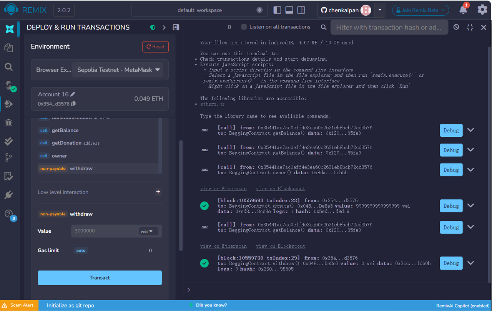

**a：ERC20/ERC721合约中的transferFrom接口如何使用？**

**ERC20：**

授权：token.approve(spender, amount);

 转移：token.transferFrom(from, to, amount);

**ERC721：**

授权：

nft.approve(spender, tokenId);

nft.setApprovalForAll(operator, true);

***b：ERC721中的授权接口跟ERC20有何不同？***

ERC20：是数量型授权（类似可以使用多少数量）

ERC721：是资产型授权（类似可以使用具体某一个）

 **c：ERC721合约中的safeTransfer等带safe前缀的接口提供了什么安全措施？**

**如果接收方是合约**，会调用其 onERC721Received 接口进行校验，只有正确实现该接口的合约才能接收 NFT，否则交易会回滚，从而防止 NFT 被误转入无法处理的合约地址而永久丢失。

**网络**：Sepolia 测试网
**合约地址**：0x048Fde76e626Dc5BE5D09dB14D54c736942De8e3

**截图**：

